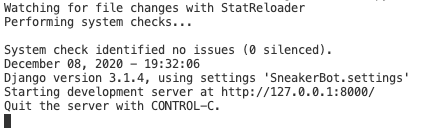
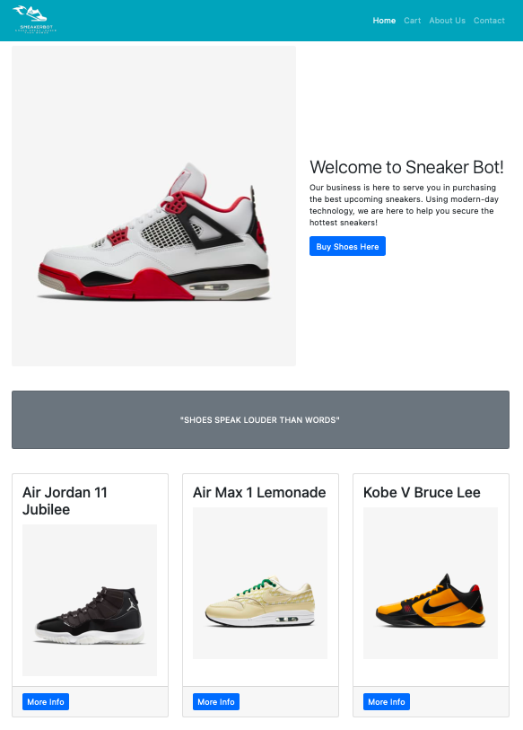
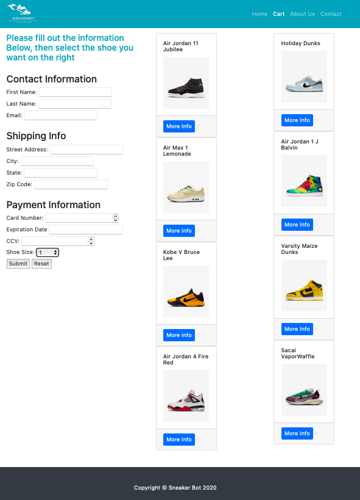
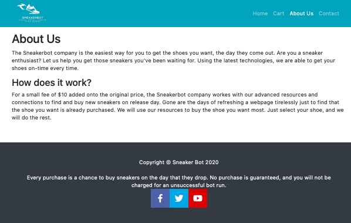
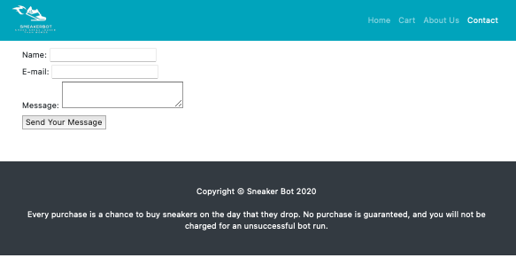

# SneakerBotWebsite
## Overview
This is a Django Web App that is designed to help customers preorder sneakers that will be purchased using a python sneaker bot. This website is user friendly and allows the user to navigate the site, selceting sneakers they wish to preorder. Their selections and information is then sent to us through email and we run the bot on the drop date of the sneakers.

## Development Environment
* VS Code
* Python 3.8.5
* SQLite 3
* Django

## Execution
Install dependencies by running 
```python
pip3 install -r requirements.txt
```
To run...
```python
python3 manage.py runserver
```

The ouput is like this:   


You can then click on the IP address to open the site. The site looks like this.   






## Useful Websites

* [Here](https://docs.python.org/3.8/) is the Python reference.
* [Here](https://www.sqlite.org/index.html) is the SQLite reference.
* [Here](https://stackoverflow.com) is Stack Overflow.
* [Here](https://www.youtube.com/watch?v=h7rvyDK70FA&t=3s) is some basics on Django.
